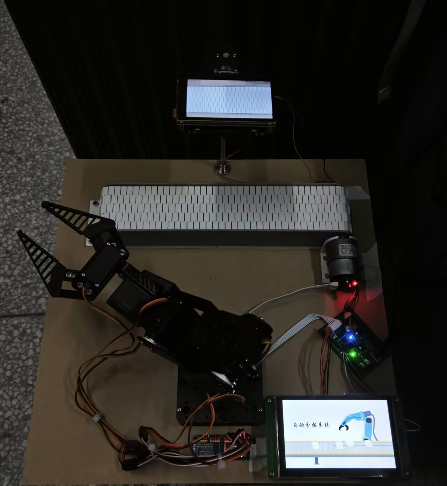
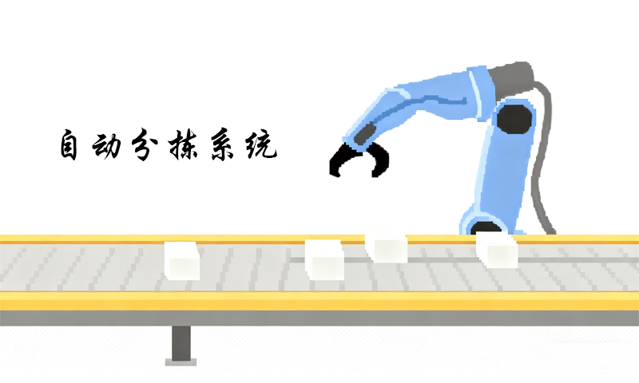
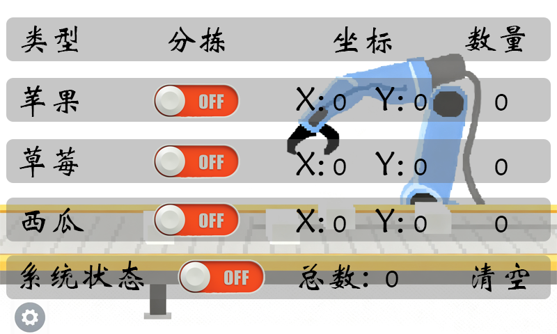
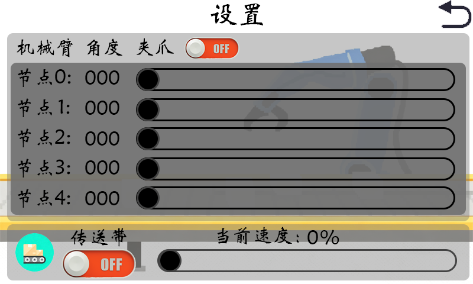

# 自动分拣系统（Automated Sorting System）

> **基于** STM32F103C8T6 的嵌入式自动分拣示例工程
>
> **更新时间**：2025-10-26
> **作者**：sleet

---

# 项目简介

本工程主要功能：

* 机械臂控制（使用 PCA9685 驱动舵机）
* 传送带驱动（L298N 驱动直流电机）
* 视觉模块（K230）的串口数据解析（DMA + 空闲接收）
* DWIN 触摸屏通信与显示控制
* 串口重定向（Retarget）以便通过 `printf` 输出调试信息

# 模型实物图

  

# DWIN界面展示

| 主页界面 | 数据界面 | 设置界面 |
|:---:|:---:|:---:|
|  |  |  |
| 系统主操作界面 | 实时数据显示界面 | 参数配置界面 |

# 主要特性

* 使用 HAL 库 + CubeMX 自动生成初始化代码
* DMA + UART 空闲中断用于高效接收视觉模块与触摸屏数据
* 设备抽象层（易于替换硬件或移植）
* 明确的目录结构，便于扩展与维护

# 目录结构

| 目录 | 功能说明 |
|------|----------|
| `Core/` | MCU初始化、时钟、中断与外设（CubeMX生成） |
| `Drivers/` | HAL与CMSIS驱动 |
| `bot_arm/` | 机械臂控制抽象（上层动作序列） |
| `PCA9685/` | PCA9685 I²C舵机驱动 |
| `l298n/` | L298N电机驱动与传送带封装 |
| `K230_uart_dma/` | K230数据解析（DMA接收 + 空闲中断） |
| `DWIN_uart/` | DWIN触摸屏命令解析与显示控制 |
| `uart/` | 串口重定向（Retarget）实现 |
| `user_main/` | 业务逻辑入口（分拣流程控制） |
| `PCB/` | PCB设计文件（立创EDA专业版） |
| `DWIN_Project/` | DWIN触摸屏项目文件 |
| `K230/` | K230 YOLO模型与示例 |

# 硬件连接

> **说明**：请根据你自己的硬件实际连接调整 `gpio`、`tim`、`i2c`、`uart` 的配置。

* MCU：STM32F103C8T6
* 舵机驱动：PCA9685（I2C）
* 电机驱动：L298N（IN1/IN2 + PWM）
* 视觉模块：K230（UART，USART2）
* 触摸屏：DWIN（UART，USART3）

# 开发环境与依赖

* GNU Arm Embedded Toolchain（arm-none-eabi-gcc）
* CMake
* CLion
* 烧录器：DAP-Link / ST-Link / 其它

# 串口与调试

* `USART1`：默认用于 `printf`（Retarget 已重定向到 `huart1`）
* `USART2`：K230（DMA + UART 空闲接收）
* `USART3`：DWIN（DMA + UART 空闲接收）

# 开发与贡献

* 欢迎提交 issue
